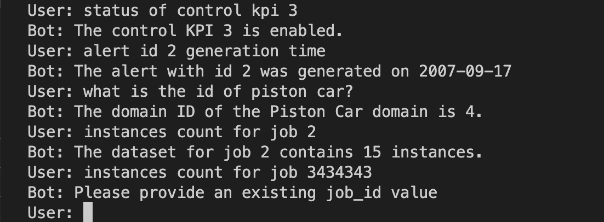

## **Table of Contents**
1. [Rasa Chatbot](#rasa-chatbot)
2. [Rasa Components](#rasa-components)
3. [Project Structure](#project-structure)
4. [Getting Started](#getting-started)
5. [FastAPI](#fastapi)
6. [API Endpoints](#api-endpoints)
7. [Getting Started](#getting-started)
8. [Example](#example)

## Rasa Chatbot

- Rasa is an open-source framework for building conversational AI chatbots and assistants. It provides tools for natural language understanding, dialogue management, and integration with external services, making it easy to create powerful and flexible chatbots for a variety of use cases.
  
## Rasa Components
Rasa is made up of several components that work together to create a chatbot:

- **NLU Pipeline**: The NLU pipeline is responsible for understanding the meaning of user messages and extracting relevant information, such as intents and entities.

- **Dialogue Manager**: The dialogue manager is responsible for managing the state of the conversation and deciding what actions to take based on user input and the current dialogue state.

- **Actions**: Actions are the tasks that the chatbot can perform, such as providing information, making recommendations, or initiating external processes.

- **Training Data**: Training data is used to teach the chatbot how to understand user messages and respond appropriately. *This includes examples of user messages, their corresponding intents and entities, and example conversations or stories.*

- **Models**: Models are machine learning models that are trained on the training data and used to make predictions about the meaning of user messages and the appropriate actions to take.

- **Endpoints and Integration**: Endpoints and integrations are used to connect the chatbot to external services, such as APIs or databases.

## Project Structure
- `actions/`: Contains custom actions used by the chatbot that retrieves data from an API endpoint based on user input..
- `data/`: Contains the json data used to train the Rasa model.
  - `nlu.yml`: Contains examples of user inputs and their corresponding intents and entities.
  - `rules.yml`: Contains rules that define the flow of the conversation and trigger actions based on user input and bot responses.
  - `stories.yml`: Contains rules that define the flow of the conversation and trigger actions based on user input and bot responses.
- `models/`: Contains the trained Rasa models.
- `config.yml`: Contains the configuration settings for the Rasa model.
- `credentials.yml`: Contains the credentials for any external services used by the chatbot.
- `domain.yml`: Contains the domain information for the chatbot, including intents, entities, and responses.
- `endpoints.yml`: Contains the endpoint information for the Rasa server and any external services used by the chatbot.

## FastAPI
- FastAPI is a modern, fast (high-performance) web framework for building APIs with Python. It is designed to be easy to use, efficient, and scalable, making it a great choice for building web applications and APIs, including chatbots. It allows you to easily integrate Rasa's natural language processing and dialogue management capabilities. This means that you can take advantage of Rasa's powerful features while benefiting from FastAPI's performance and scalability.

## API Endpoints

The chatbot calls an API endpoint to return an answer based on user input question. 

> The project provides the following API endpoints:

1. GET `/by-id/alert_id={id}`: Retrieves data for a specific alert ID.
2. GET `/supervised_job_asset={job_id}`: Retrieves data for a specific job id.
3. GET `/control_kpi/={kpi_id}"`: Retrieves data a specific KPI ID.
4. GET `/domain_id={domain_id}`: Retrieves data for a specific domain ID.
5. GET `/count/{domain_name}`: Retrieves the count of data records for a specific domain name.
6. GET `/count/domain_name={domain_name}`: Retrieves data for a specific domain name.


**To Run the server**
  
   ```
   make fastapi
   ```

**To check that the api is up and running you can try**
```
curl http://localhost:8000/domain_id=[domain_id]
```
> This will send a GET request to the GET `/domain_id` endpoint with the domain_id

Here is corresponding response that you can expect from The endpoint returns a JSON object with the following format after replacing `[domain_id]` with `2`:

```json
{
   "result": {
   "id": 2,
   "name": "Device 2",
   "device_name": "Device B",
   "device_id": 5678,
   "domain_id": 1002,
   "device_attribute": "Attribute 2",
   "device_longitude": 34.0522,
   "device_latitude": -118.2437,
   "generation_time": "2015-11-22",
   "opened": false,
   "criticality": "Medium",
   "domain_name": "Domain B",
   "device_code": "DEF456",
   "closure_reason": "",
   "removal_time": null,
   "alert_id": 9876,
   "reading_value": "75",
   "sop_ids": "SOP003",
   "message_id": "MSG002",
   "last_updated_date": "2021-09-09",
   "vertical_id": 202,
   "vertical_name": "Vertical Y",
   "site_id": 890,
   "site_name": "Site 2"
   }
}
```

## Getting Started

**After running `FastAPI Server` you can test the chatbot by running these 3 commands:**

1. Running Rasa Actions
   ```
   make rasa-actions
   ```

2. Running Rasa Api
   ```
   make rasa-run
   ``` 
3. Running python script to chat with the bot
   ```
   make rasa-chat
   ```


## Example
<br>



